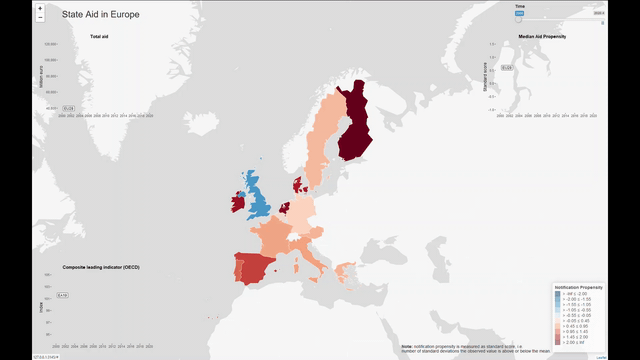

## Wiktor Owczarz

### Personal details

`Address:` Berlin  
`Email:` [wiktor.owczarz[at]gmail.com](mailto: wiktor.owczarz@gmail.com)  
`Contributions:` &ensp;  &ensp;   

___

### Who am I?

Economist who likes to transform problems into code. I have broad experience including econometrics, geographical analysis and large data processing. In my free time I enjoy food, cycling and long walks with dog.

___

### Education  

09/2016 - 09/2018 | **MSc Economics (Research)**, *Maastricht University*  
 &emsp;  Thesis: [Natual Language Processing in Banking Competition Studies](https://github.com/ln-P/MasterThesis)  
10/2015 - 03/2016 | **BSc Economics**, *Humboldt University (Exchange Semester)*  
09/2013 - 03/2016 | **BSc Economics**, *Maastricht University*  

___

### Experience 

03/2023 - &nbsp;&nbsp;&nbsp;&nbsp;&nbsp;&nbsp;&nbsp;&nbsp;&nbsp;&nbsp;&nbsp;&nbsp;&nbsp; | **Senior Data Scientist**, *Compass Lexecon* (Python, R, SQL)  
03/2022 - 03/2023 |   **Data Scientist**, *Compass Lexecon* (Python, R, SQL)  
03/2021 - 03/2022 |   **Associate Data Scientist**, *Compass Lexecon* (Python, SQL) 
11/2018 - 02/2021 | **Economist**, *E.CA Economics* (Python, R, STATA, ArcGIS)  
02/2018 - 10/2018 | **Data Science Intern**, *Haensel - AMS* (Python, SQL)  
11/2017 - 09/2018 | **Research Assistant**, *Maastricht University* (Python)  
11/2016 - 05/2017 | **Teaching Assistant**, *Maastricht University*  
01/2016 - 09/2016 | **Analyst and Working Student**, *Zalando* (R, Shiny)  
06/2015 - 09/2015 | **Economic Analyst**, *Embassy of Poland in London* (R)  

___

### Skills
`Technologies:`Python (standard toolkit and folium, pySpark), R (Shiny, ggplot2,
dplyr), SQL, MongoDB, Databricks, Git, STATA, ArcGIS, Tableau, LaTeX, beginner: cloud, AWS (EC2, S3) and Azure (Blob Storage, Delta Lakes)  
`Languages:` Polish (native), English (fluent), German (intermediate - B2.1)  

___

### My projects

#### Work related publications that I was involved in
* [Building geospartial analysis toolkit](https://www.compasslexecon.com/a-taste-of-geospatial-analysis-for-competition-economics/)
* [Record linkage package in competition analysis](https://www.compasslexecon.com/game-set-and-fuzzy-match/)
* [Web application for searching within antitrust documents](https://www.compasslexecon.com/decision-search-tool-behind-the-scenes/)

#### State aid notifications over time
 
I prepared interactive map (in R-Shiny) that captures notification propensity in response of the economic developments across Europe. The maps allows to observe the scale of the response to the COVID-19 crisis. [Follow the link to see the full map.](./map.gif) 

#### EU regional aid framework - retrospective evaluation
I was part of a team preparing retrospective evaluation support study on the EU regional aid framework applicable from 2014 to 2020 (“the RAF 2014”). I was mainly responsible in creation of the geospartial visualizations of Europe. [Publication of the study on the EU website.](https://op.europa.eu/en/publication-detail/-/publication/4c143fec-6281-11ea-b735-01aa75ed71a1/language-en/format-PDF/source-121845138) 

#### Availability of rental cars across United Kingdom in October 2021 
<iframe width="623.5" height="650.5" seamless frameborder="0" scrolling="no" src="./gb_rental_agencies_map.html"></iframe>
**Source**: Rentalcars.com (car availability on 12 October 2021) 

